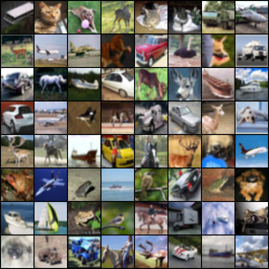

# Synthetic Image Generation With GANs - Implementation

<h2>Deep Convolutional Generative Adversarial Network (DC-GAN)</h2>

DC-GAN has revolutionized image synthesis across multiples domains. Its ability to create high quality and visually stunning images has standardized its usage in various applications. Its accomplishments in generating 
  images have assisted technicians like data augmentation in medical images and challenged artists with novel artworks. Its impact transcends traditional machine learning.

DC-GAN is an advanced version of GAN that is specifically designed for image generation tasks. DC-GAN consists of two components: Generator and Discriminator. Both these components contain convolutional neural networks (CNNs)
which makes it possible to analyze images. The generator and the discriminator interact in an adversarial manner with each other. The generator takes random noise as input and is designed with an objective to generate realistic
images. The discriminator is trained to differentiate the real images in the dataset from the images that are synthesized by the generator.

 </img>

<h3>Generator</h3>

As mentioned, the generator accepts random noise or data from latent space as input to learns to generate realistic images from the noise. It generally maps the latent space to image space. Its structure composes of a series
of convolutional layers, Batch normalization layers, ReLU activation function, and an output layer. It possesses a mechanism to increase the spatial size of the image to generate images with higher resolution.

<ul>
  <li>Input: A random noise vector or latent space vector</li>
  <li>Convolutional layers: These layers takes the noise as input and upsample it to generate feature vectors. These layers increase spatial size and decrease the depth of the feature maps.</li>
  <li>Batch normalization: Normalizes the activation output for each layer. Helps in stablizing the training process. </li>
  <li>Activation function: ReLU function is used after each batch normalization layer to maintain non-linearity in the network.</li>
  <li>Output layer: Final layer in the network with <b>tanh</b> as activation function to squash the values between -1 and +1 for synthesized images. </li>
</ul>

<h3>Discriminator</h3>

The discriminator network is trained to classify the real images of the dataset from the synthetic images created by the generator. This block accepts an image as input and learns to classify it as real or fake. It assigns
value <b>1</b> to real images and the value <b>0</b> to fake images. Similar to the generator network, the discriminator consists of several components.

<ul>
  <li>Input: A real or generated image</li>
  <li>Convolutional layers: These layers processees the image and downsample it to generate feature maps. These layers decrease the spatial size and increase the depth of the feature maps.</li>
  <li>Batch normalization: Normalizes the activation output for each layer. Helps in stablizing the training process. </li>
  <li>Activation function: Leaky ReLU function is used after each batch normalization layer to maintain non-linearity in the network. It accepts a small range of negative values preventing <i>dying ReLU</i> problem.</li>
  <li>Output layer: Final layer contains single neuron with <b>Sigmoid</b> as activation function that generates the value <b>0</b> or the value <b>1</b> classifying the image. </li>
</ul>

<h2>DC-GAN Training</h2>

The decoder network of the DC-GAN is trained using supervised image dataset that consists of collection of real images and synthetic images generated by the GAN networks. Real images are mapped with the value <b>1</b>
and the fake images are mapped with the value <b>0</b>. As the classification is between 2 classes, binary crossentropy should suffice the training process.

The generator network of the DC-GAN extracts the data from the latent space to generate images. The objective of the generator network is to increase the score of the generated images towards higher end. This is achieved
with the help of the discriminator network. The loss function defined for the generator network is binary crossentropy between the probabilities and a vector of ones. The aim is to generate synthetic images in a way that
the discriminator perceives as a real one.

Usually, training of components of DC-GAN is exclusive to each other. When the generator undergoes training, the discriminator remains constant. This prevents the discriminator network adapting to generalize synthetic
images as real ones which ultimately ends up with hindering the generator's progress. 

<h2>Implementation </h2>

<ul>
<li>Dataset used to define the real images: CIFAR10 dataset </li>
<li>Learning rate: 0.0002 </li>
<li>Input for the generator network: Random noise with mean value <b>100</b> and variance value <b>1</b> </li>
</ul>

<h2>Results</h2>

Real image: This picture shows the collage formed from CIFAR10 dataset

  

<l>Epoch 1: A collage of images synthesized by the generator in the first epoch</l>

  

The subsequent samples show the progress in training and generation of synthetic images

Epoch 5:

  

Epoch 15:

  

Epoch 22:

  

<h2>References</h2>

<ol>
  <li>A. Kumar, “DCGAN Architecture Concepts, Real-world Examples - Analytics Yogi,” Analytics Yogi, Aug. 03, 2023. https://vitalflux.com/dcgan-architecture-concepts-real-world-examples/</li>
  <li>DC-GAN image: A. Kumar, “Generative Adversarial Network (GAN): Concepts, Examples - Analytics Yogi,” Analytics Yogi, Jul. 23, 2023. https://vitalflux.com/examples-generative-adversarial-network-gan/</li>
</ol>
